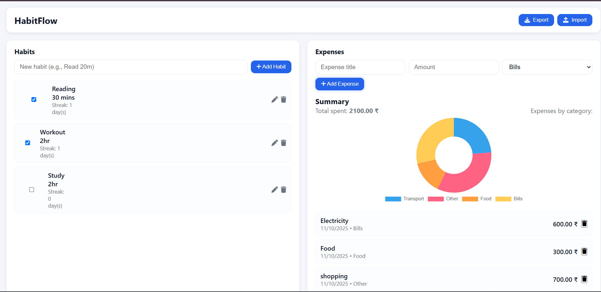
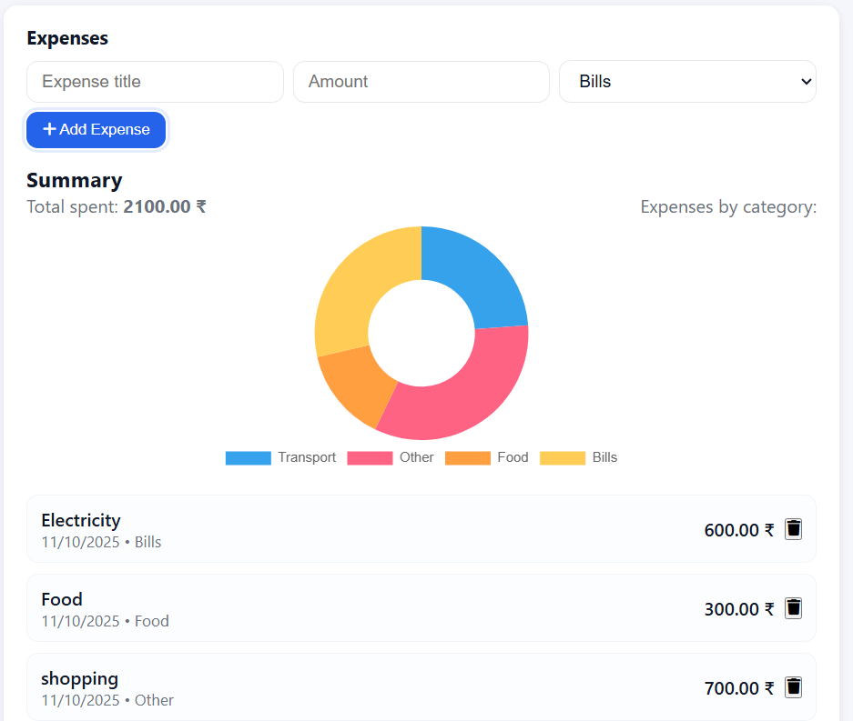
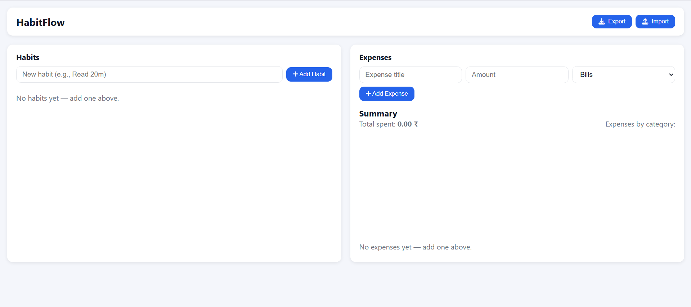

# 🌿 HabitFlow

**HabitFlow** is a minimal and responsive web application that helps you stay consistent with your daily habits while keeping an eye on your expenses — all in one place.  
It’s designed for people who want a simple, distraction-free way to build habits and track spending, without needing an account or any setup.

Built using **HTML, CSS, and JavaScript**, it runs entirely in your browser and saves your data locally.

---

### 🌐 Live Demo  
👉 [Open HabitFlow](https://drupathmm.github.io/habitflow/)

---

### 💡 About the Project

The idea behind *HabitFlow* is to bring habit building and expense tracking together in one simple tool.  
Most apps focus on just one — but in reality, both are part of your daily discipline.  

I created this project to improve my front-end development skills and understand how to build a fully functional web app from scratch, with features like persistent local storage, dynamic rendering, and data visualization.

---

### ✨ Features

- Add, edit, and delete daily habits  
- Track habit streaks and completion days  
- Add expenses with categories (Food, Transport, Bills, Other)  
- View spending insights with a live doughnut chart (Chart.js)  
- Data saved locally in the browser — no backend required  
- Import or export your data as a backup  
- Responsive design — works perfectly on desktop and mobile  
- Clean, lightweight, and easy to use  

---

### 🧩 Tech Stack

| Technology | Purpose |
|-------------|----------|
| **HTML5** | Page structure and layout |
| **CSS3** | Styling, responsive design, and layout |
| **JavaScript (Vanilla)** | Core app logic and interactivity |
| **Chart.js** | Expense chart visualization |
| **Font Awesome** | Icons for actions and UI elements |
| **GitHub Pages** | Hosting and deployment |

---

### 🖼️ Screenshots

| Habit Tracker | Expense Tracker |
|----------------|-----------------|
|  |  |

<p align="center">
  
</p>

> A clean, responsive dashboard to track your habits and expenses side by side.

---

### ⚙️ Getting Started  

You can run HabitFlow locally or view it directly online.

#### Option 1: Run Locally  
1. Clone this repository  
   ```bash
   git clone https://github.com/drupathmm/habitflow.git
